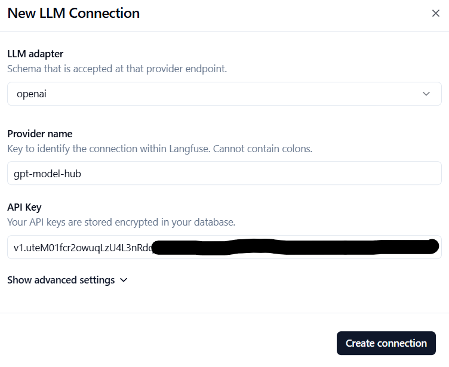
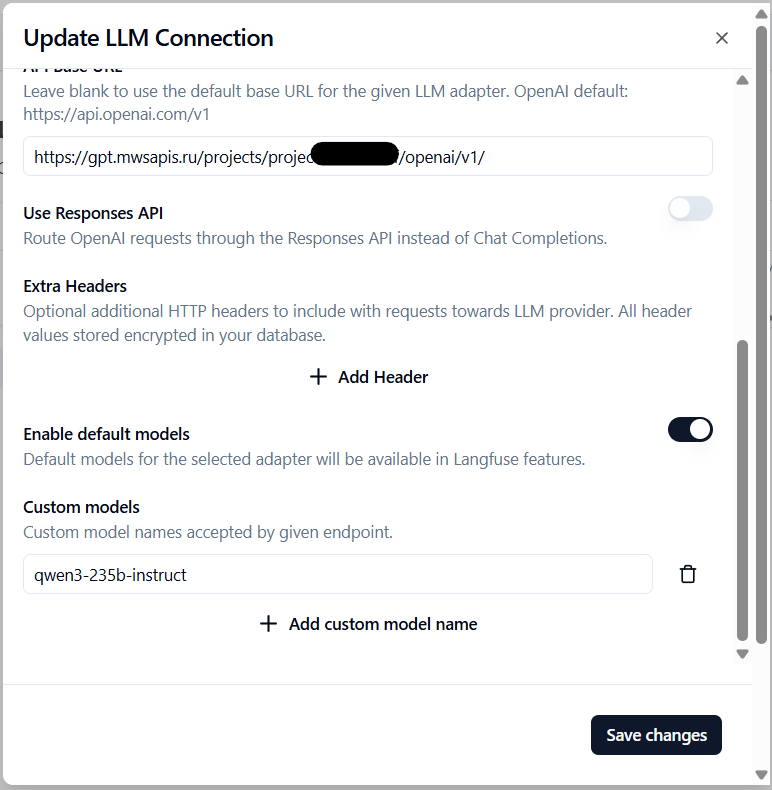
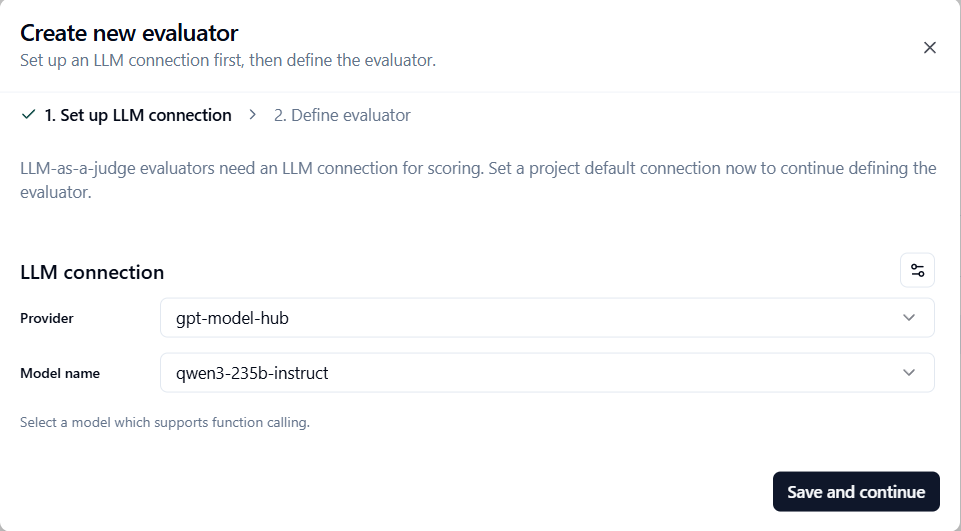
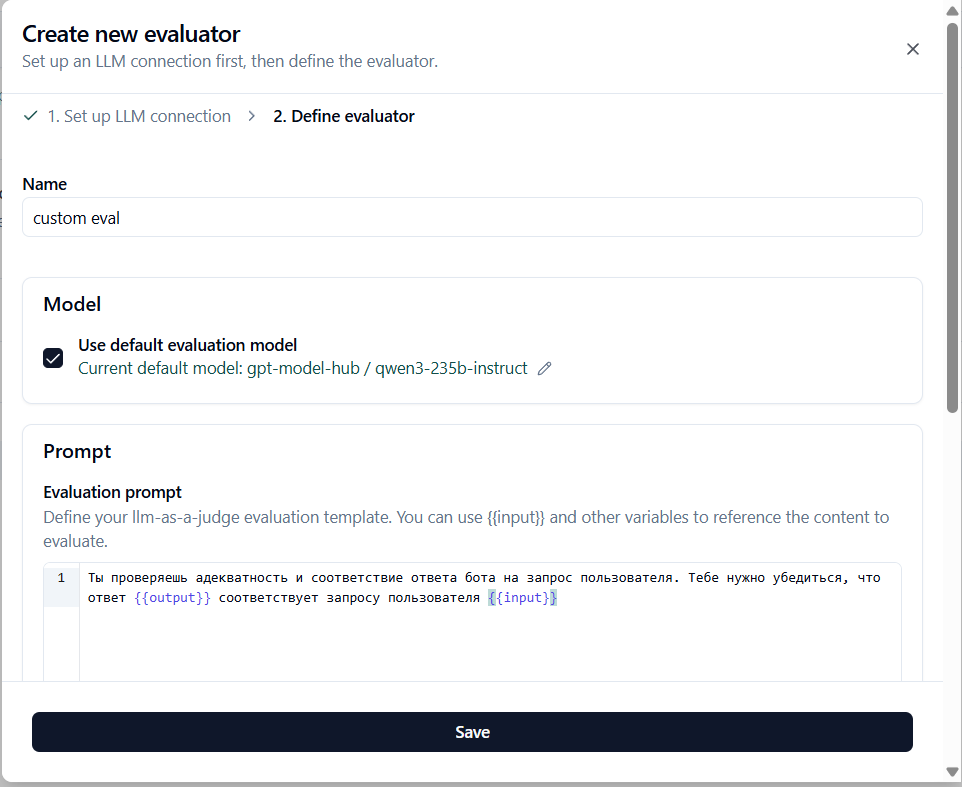
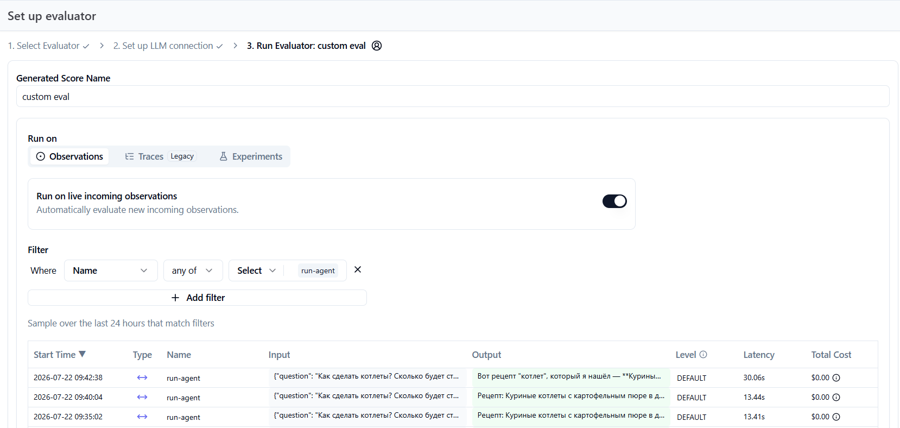
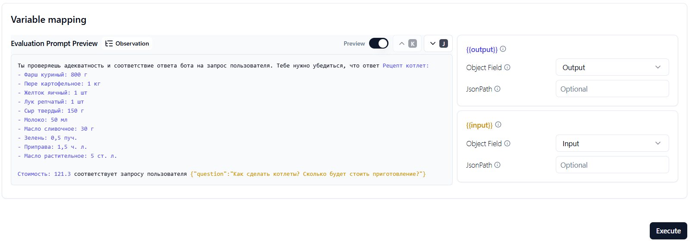
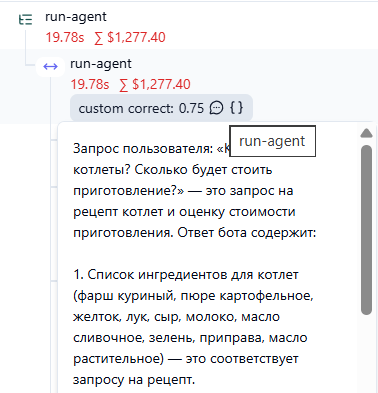
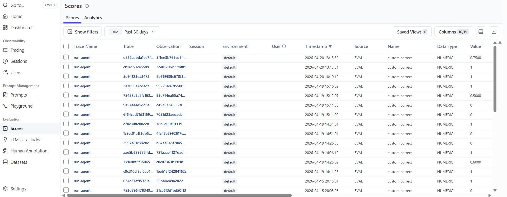
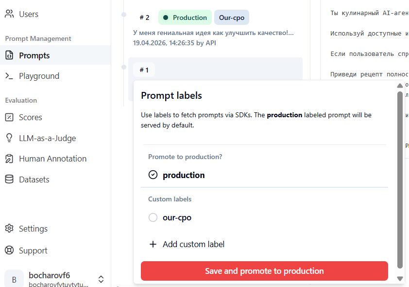

# Проблема Prompt Regression

Ошибочное изменение промпта (иногда незначительное) может привести к ухудшению качества ответов агента. Наш агент использует [централизованное управление промтами в Langfuse](https://langfuse.com/docs/prompt-management/overview), что позволяет менять промпт налету, без выкатки релиза. Это дает гибкость, но может привести к регрессу.

Именно это случилось с нами! Наш CPO исправил промпт прямо в Langfuse и внес регресс. Вы могли определить это, посмотрев на `output` спана `choose_prompt`.

Что с этим делать?

# Добавить контроль качества с LLM-as-a-judge

Для начала нам нужно научиться автоматически отслеживать регресс.
Давайте научимся автоматически оценивать качество ответов агента (`Evaluation`) с помощью другой LLM — эта техника называется **LLM-as-a-judge** (LLM-как-судья).

Документация:

- [LLM Connection](<https://langfuse.com/docs/administration/llm-connection>)
- [LLM-as-a-judge](<https://langfuse.com/docs/evaluation/evaluation-methods/llm-as-a-judge>)

## Создайте подключение к LLM в проекте Langfuse

В вашем проекте Langfuse зайдите в раздел:

**Settings \ LLM Connections**

Создайте новое подключение к LLM - нажмите **Add LLM Connection**, укажите:

- LLM adapter: `openai`
- Provider name: `gpt-model-hub`
- API key: `v1.......`

Где API Key - это ваш ключ от LLM, который вы ранее указали в параметре `LLM_TOKEN` файла `.env`.



Разверните пункт **Show advanced settings** и укажите:

- API Base URL: `https://gpt.mwsapis.ru/projects/ЗАМЕНИТЬ_НА_ВАШ_ПРОЕКТ/openai/v1/`.
- Custom models: `gpt-oss-120b`.

Где API Base URL - это адрес вашего проекта, который вы ранее указали в параметре `LLM_URL` файла `.env`.



## Создайте Evaluator

Для этого в вашем проекте Langfuse перейдите в раздел **Evaluators**

Нажмите **Create evaluator** и выберите **LLM as a judge evaluator**



Выберите имя для шаблона, например `custom eval` и введите примерно такой текст в **Evaluation prompt**:

```
Ты проверяешь адекватность и соответствие ответа бота на запрос пользователя. Тебе нужно убедиться, что ответ {{output}} соответствует запросу пользователя {{input}} и вернуть оценку от 0 до 1, где 0 - ответ полностью не соответствует запросу, а 1 - ответ полностью соответствует запросу.
```

Нажмите **Save**



## Настройте фильтр для выбора спанов

В разделе фильтр удалите все установленные фильтры по умолчанию (`Type` и `Environment`)
И добавьте единственное условие **Name any of run-agent**, чтобы проверка работала только для финального спана.

Если фильтр выбран верно - вы увидите список подходящих спанов **run-agent** в таблице.



Настройте маппинг секций `{{output}}` и `{{input}}` — установите **Object Field** в **Output** и **Input** соответственно.



## Сделайте запросы к агенту

Сделайте несколько запросов к агенту

## Задача 

Добиться появления в трейсах Langfuse у спана `run-agent` оценки качества и ее обоснования.



На закладке **Evaluation -> Scores** вы также можете посмотреть все оценки. А на вкладке **Analytics** вывести оценки на график, чтобы визуально отслеживать изменения качества ответов во времени.



# Теперь исправим ошибку CPO и откатим испорченный prompt

В Langfuse на закладке **Prompts** выберите первую версию промпта `#1` и поставьте на нее метку `production` 



Сделайте несколько запросов к агенту

## Задача

После отката некорректного промпта мы должны увидеть рост оценок качества в трейсах Langfuse с 0 до 1.
