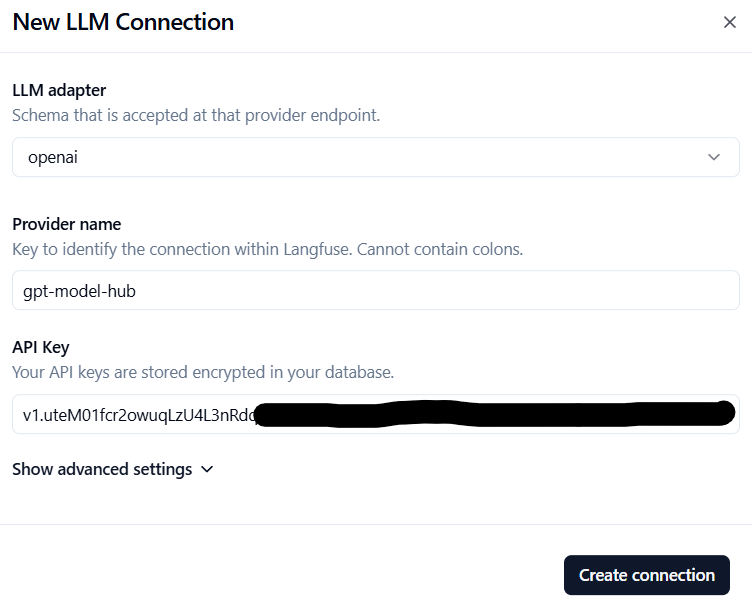
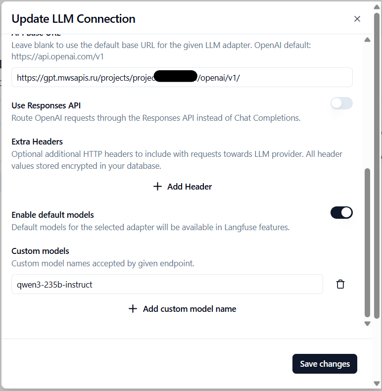
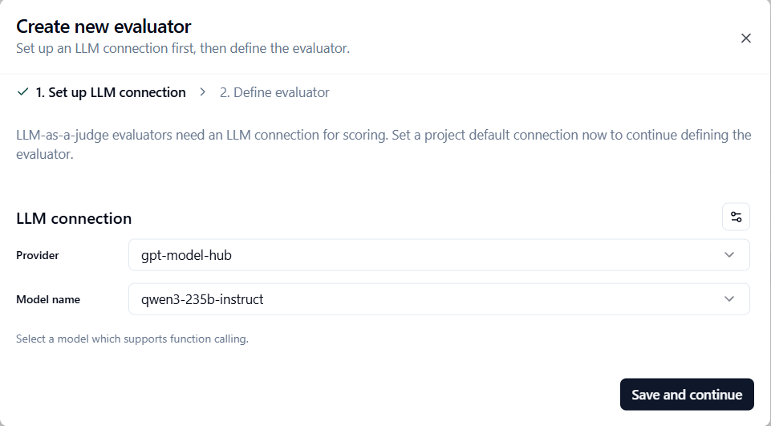
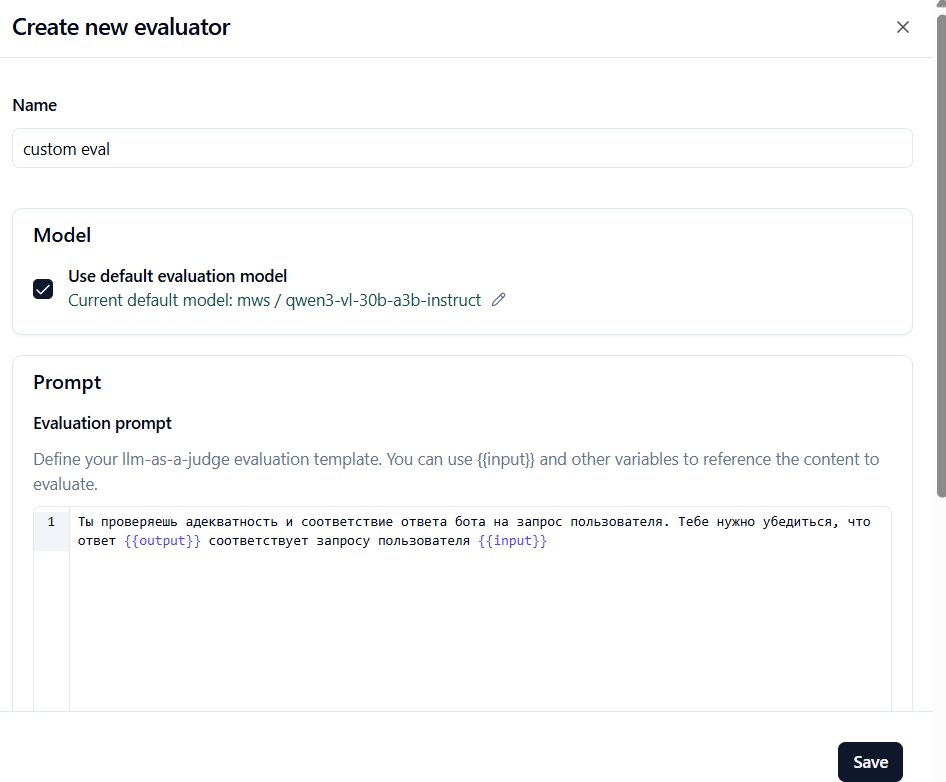
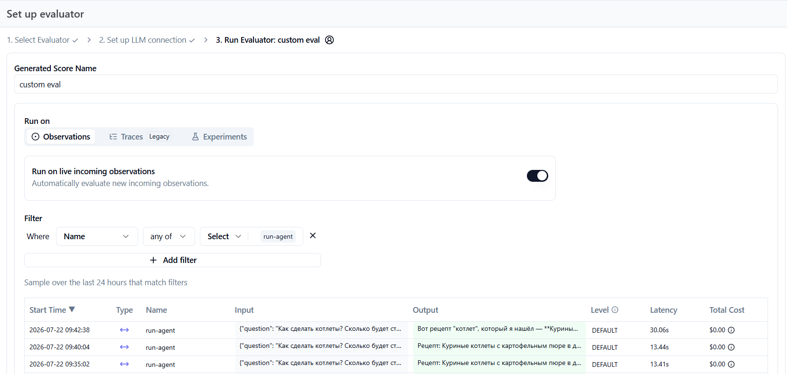
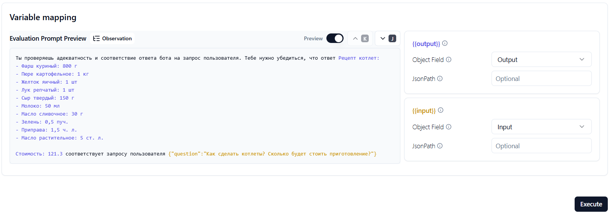
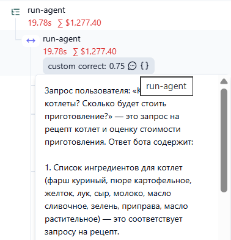
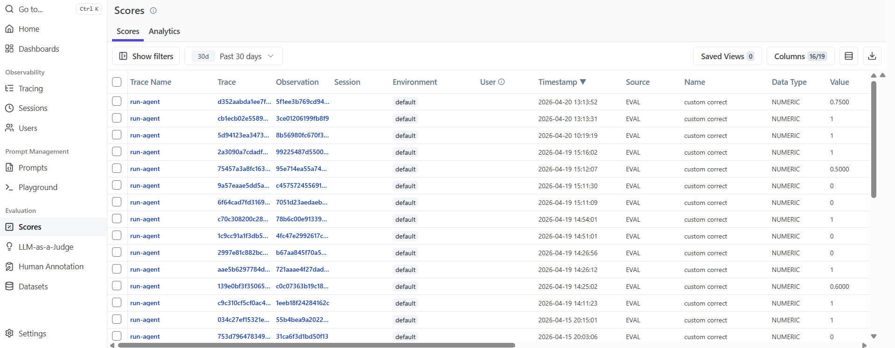
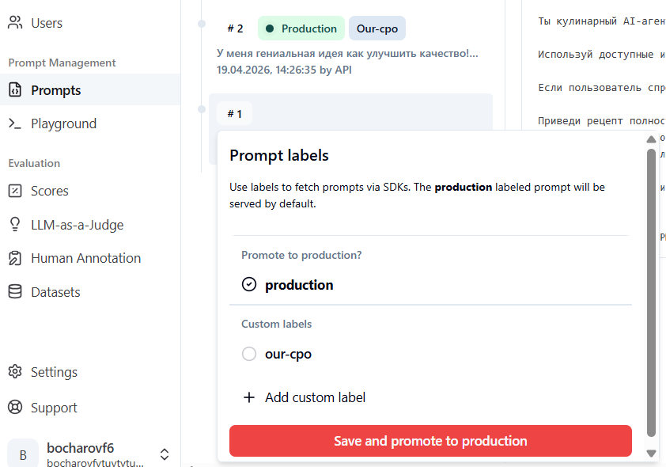

# Проблема Prompt Regression

Ошибочное изменение промпта (иногда незначительное) может привести к ухудшению качества ответов агента. Наш агент использует [централизованное управление промтами в Langfuse](https://langfuse.com/docs/prompt-management/overview), что позволяет менять промпт налету, без выкатки релиза. Это дает гибкость, но может привести к регрессу.

Именно это случилось с нами! Наш CPO решил расширить аудиторию и прямо в Langfuse дописал в промпт всего одну строку:

```
Наша целевая аудитория теперь 16–24 года — говори с ними на их языке.
```

Агент понял это буквально и начал отвечать всем пользователям на молодежном сленге: «Йоу! Держи рецепт», «вкус — просто имба». Рецепт при этом остался правильным - сломался тон, а не содержание.

Вы могли определить это, посмотрев на `output` спана `choose_prompt`, или сравнив версии промпта `final-normal-prompt` в разделе **Prompts**: у новой версии CPO оставил комментарий «Расширяемся на молодую аудиторию!».

Что с этим делать?

# Добавить контроль качества с LLM-as-a-judge

Для начала нам нужно научиться автоматически отслеживать регресс.
Давайте научимся автоматически оценивать качество ответов агента (`Evaluation`) с помощью другой LLM — эта техника называется **LLM-as-a-judge** (LLM-как-судья).

Документация:

- [LLM Connection](<https://langfuse.com/docs/administration/llm-connection>)
- [LLM-as-a-judge](<https://langfuse.com/docs/evaluation/evaluation-methods/llm-as-a-judge>)

## Создайте подключение к LLM в проекте Langfuse

В вашем проекте Langfuse зайдите в раздел:

**Settings \ LLM Connections**

Создайте новое подключение к LLM - нажмите **Add LLM Connection**, укажите:

- LLM adapter: `openai`
- Provider name: `gpt-model-hub`
- API key: `v1.......`

Где API Key - это ваш ключ от LLM, который вы ранее указали в параметре `LLM_TOKEN` файла `.env`.



Разверните пункт **Show advanced settings** и укажите:

- API Base URL: `https://gpt.mwsapis.ru/projects/ЗАМЕНИТЬ_НА_ВАШ_ПРОЕКТ/openai/v1/`.
- Custom models: `qwen3-6-35b-a3b`.

Где API Base URL - это адрес вашего проекта, который вы ранее указали в параметре `LLM_URL` файла `.env`, с добавленным в конце `/v1/`.

Модель `qwen3-6-35b-a3b` будет судьей. Мы берем для оценки отдельную модель, чтобы проверки не расходовали лимит запросов основной модели агента: у `glm-5-3` в MWS GPT всего 10 запросов в минуту. Модель `gpt-oss-120b` для судьи не подойдет - Langfuse не сможет ее сохранить, проверочный запрос к ней зависает.



## Создайте Evaluator

Для этого в вашем проекте Langfuse перейдите в раздел **Evaluators**

Нажмите **Create evaluator** и выберите **LLM as a judge evaluator**



Судья использует модель оценки по умолчанию (**Default Evaluation Model**). Когда Langfuse попросит ее настроить, выберите провайдера `gpt-model-hub` и модель `qwen3-6-35b-a3b`. При сохранении Langfuse отправит проверочный запрос к модели - это займет несколько секунд.

Выберите имя для шаблона, например `custom eval`.

Судье важно объяснить, что именно для нас значит «хороший ответ». Если просто попросить его проверить соответствие ответа запросу, он поставит сленговому ответу высший балл - ведь рецепт в нем правильный. Поэтому кроме содержания мы явно просим проверять тон. Введите примерно такой текст в **Evaluation prompt**:

```
Ты оцениваешь ответ кулинарного бота. Бот работает для широкой аудитории и должен отвечать вежливо, в нейтральном литературном стиле, обращаясь к пользователю на «вы».

Запрос пользователя: {{input}}
Ответ бота: {{output}}

Проверь два критерия:
1. Содержание: ответ соответствует запросу — в нём есть рецепт с ингредиентами и их количеством, а если пользователь спрашивал о стоимости — указана стоимость.
2. Тон: ответ написан нейтральным литературным языком. Сленг, жаргон, фамильярность, обращение на «ты», подражание молодёжной речи — нарушение тона.

Верни оценку от 0 до 1:
- 1 — оба критерия соблюдены;
- 0.5 — содержание в порядке, но в тоне есть отдельные неуместные слова;
- 0 — тон явно нарушен (сленг, фамильярность) или ответ не соответствует запросу.
```

Нажмите **Save**



## Настройте фильтр для выбора спанов

В разделе фильтр удалите все установленные фильтры по умолчанию (`Type` и `Environment`)
И добавьте единственное условие **Name any of run-agent**, чтобы проверка работала только для финального спана.

Если фильтр выбран верно - вы увидите список подходящих спанов **run-agent** в таблице.



Настройте маппинг секций `{{output}}` и `{{input}}` — установите **Object Field** в **Output** и **Input** соответственно.



## Сделайте запросы к агенту

Сделайте несколько запросов к агенту. Оценка появляется в трейсе через несколько секунд после ответа агента. Если у какого-то трейса оценки нет, значит запрос к модели-судье не уложился в таймаут - просто сделайте еще один запрос.

## Задача 

Добиться появления в трейсах Langfuse у спана `run-agent` оценки качества и ее обоснования. Пока действует промпт CPO, оценки должны быть близки к 0, а в обосновании судья перечислит найденный сленг.



На закладке **Evaluation -> Scores** вы также можете посмотреть все оценки. А на вкладке **Analytics** вывести оценки на график, чтобы визуально отслеживать изменения качества ответов во времени.



# Теперь исправим ошибку CPO и откатим испорченный prompt

В Langfuse на закладке **Prompts** выберите первую версию промпта `#1` и поставьте на нее метку `production` 



Сделайте несколько запросов к агенту

## Задача

После отката некорректного промпта мы должны увидеть рост оценок качества в трейсах Langfuse с 0 до 1.
