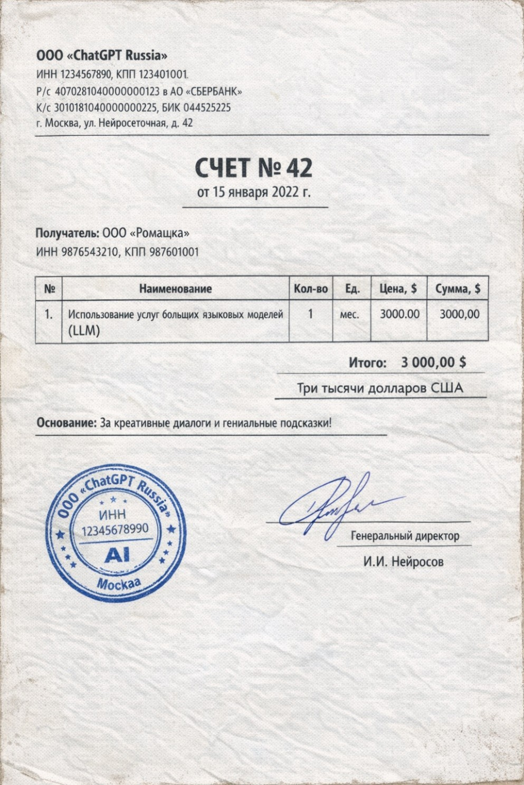

# Ситуация

На вашем столе лежит счет от провайдера LLM на тысячи долларов. 

Вы в шоке. 

Ваш финансовый директор в шоке.

## Узнайте, сколько стоила работа агента

1. В Langfuse на закладке **Home** изучите виджет **Model cost**.
2. Посмотрите отчет **Langfuse Cost Dashboard** на закладке **Dashboards**.

## Задача

1. Определить, сколько денег было потрачено на работу агента.
2. Провести диагностику и выяснить, почему сумма такая большая.

В диагностике вам помогут ответы на вопросы:

- Какие модели мы используем в агенте (смотри в `docker-compose.yml`)?
- Какая модель будет использована при запросе `что ты умеешь?`? Почему?
- Для каких моделей в **Settings \ Model Definitions** указана формула расчета цены?
- Все ли верно в [этом коммите](https://github.com/bocharovf/langfuse-workshop/commit/e58f772751a05977bd29965e89397856f41483d1)?

Документация:

- [Стоимость запросов](https://langfuse.com/docs/observability/features/token-and-cost-tracking)

**Знаешь ответ - подними руку!**