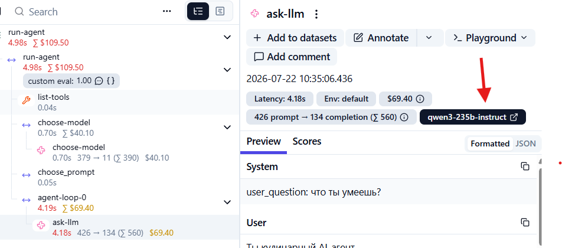

# Проблема Model Routing

Работая с LLM вы платите за каждый входящий и исходящий токен (запрос и ответ). Обычно, чем умнее модель, тем дороже стоит каждый токен. В целях экономии, агенты часто выбирают более дешевые модели для простых задач. Это называется **Model Routing**.

Ошибка в логике выбора модели может привести к росту затрат и неоптимальному использованию ресурсов. Именно это и произошло в нашем сценарии!

В функции `choose_model` заложена логика использования дешевой модели `qwen3-32b` для запросов, не требующих вызова MCP. Но из-за некорректного сравнения всегда используется только дорогая модель `qwen3-235b-instruct`. В этом можно убедиться, посмотрев на атрибуты спана `ask-llm`: 



## Как исправить код

В функции `choose_model` исправьте проверку значения переменной `tools_request`. 

Эта переменная имеет **строковое значение** и такая проверка всегда будет возвращать `True`:

```python
if tools_request == True:
    result = {"model": REGULAR_MODEL, "tool_calls": tools_request == "true"}
else:
    result = {"model": BASIC_MODEL, "tool_calls": tools_request == "true"}
```

Корректная проверка выглядит вот так:

```python
if tools_request == "true": # !!!
    result = {"model": REGULAR_MODEL, "tool_calls": tools_request == "true"}
else:
    result = {"model": BASIC_MODEL, "tool_calls": tools_request == "true"}
```

Перезапустите агент:
```
docker compose up -d --force-recreate cookbook-agent
```

Теперь снова спросите агента `что ты умеешь?`.

## Задача

Добиться использования дешевой модели `qwen3-32b` для простых запросов в спанах `ask-llm`. 