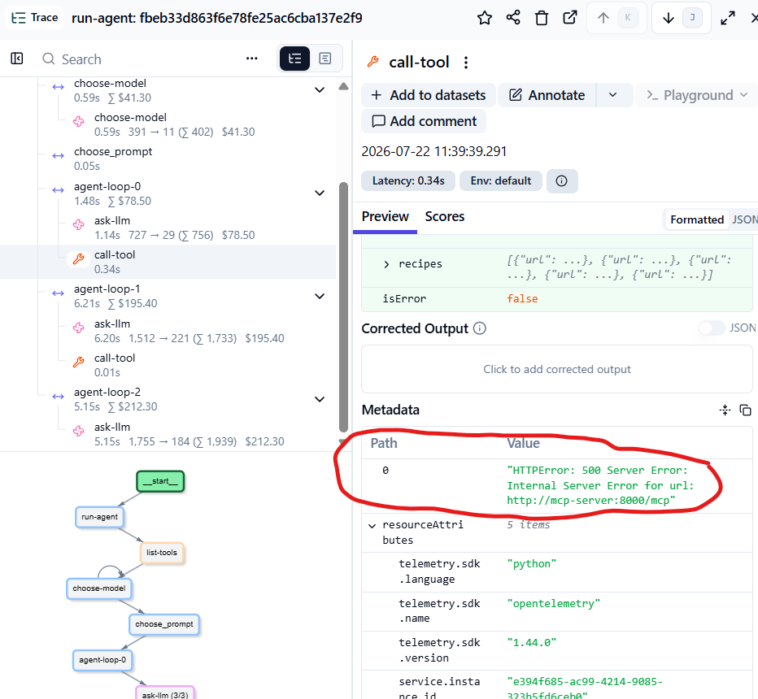

# MCP - черный ящик

MCP-серверы могут сбоить – возвращать ошибки или работать слишком медленно. В нашем случае MCP-сервер с некоторой вероятностью возвращает ошибку.

Вы можете сами убедиться в этом, увидев спаны с пометкой `ERROR` в трейсе.

## Добавление retry вызовов MCP

В случае ошибки метода MCP, мы можем повторно вызывать его, чтобы повысить общие шансы на успех.

В файле `mcp-client.py` в функциях `list_tools` и `call_tool` добавьте цикл со счетчиком попыток. 

Для лучшей наблюдаемости стоит записывать неудачные попытки в метаданные спана.

Общая структура:

```python
for attempt in range(MAX_RETRIES):
    try:
        # вызов MCP

        tool.update(output=result)
        return result
    except Exception as e:
        tool.update(metadata={attempt: e})
        if attempt < MAX_RETRIES - 1:
            continue
        else:
            raise e
```

Полный код:

```python
MAX_RETRIES = 3

def list_tools():

    with langfuse.start_as_current_observation(as_type="tool", name="list-tools") as tool:
        r = requests.post(
            f"{MCP_URL}",
            headers=_build_base_headers(),
            json=_build_base_request("tools/list"),
            timeout=5,
        )    
        for attempt in range(MAX_RETRIES):
            try:
                r.raise_for_status()
                result = [_create_llm_tool_definition(t) for t in r.json()["result"]["tools"]]

                tool.update(output=result)
                return result
            except Exception as e:
                tool.update(metadata={attempt: e})
                if attempt < MAX_RETRIES - 1:
                    continue
                else:
                    raise e

def call_tool(name, arguments):

    with langfuse.start_as_current_observation(as_type="tool", name="call-tool", input=arguments) as tool:
        tool.update(input={"name": name, "arguments": arguments})
        payload = _build_base_request("tools/call")
        payload["params"] = {
            "name": name,
            "arguments": arguments,
        }
        for attempt in range(MAX_RETRIES):
            try:
                r = requests.post(
                    f"{MCP_URL}",
                    headers=_build_base_headers(),
                    json=payload,
                    timeout=5,
                )
                r.raise_for_status()
                result = r.json()["result"]
                tool.update(output=result)
                return result
            except Exception as e:
                tool.update(metadata={attempt: e})
                if attempt < MAX_RETRIES - 1:
                    continue
                else:
                    raise e
```

Не забудьте объявить константу `MAX_RETRIES` с ограничением на число итераций:

```
MAX_RETRIES = 3
```

Перезапустите агент:
```
docker compose up -d --force-recreate cookbook-agent
```

Попробуйте запросить агент снова.

## Задача

Добиться работы агента даже при ошибках MCP

Неудачные ошибки должны логироваться в метаданных спана call-tool:

