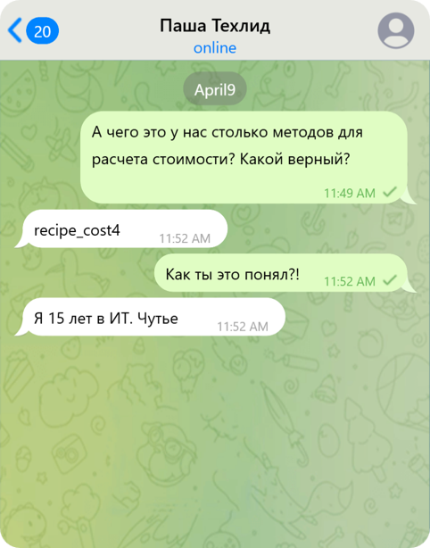

# Проблема разрастания количества методов MCP

Стоимость приготовления почему-то теперь выросла до миллионов рублей!

Все дело в том, что ваш агент развивается, и вы подключаете дополнительные MCP сервера, чтобы расширить его возможности. Но увеличение числа доступных методов может привести к разрастанию контекста и пересечению их по функционалу. LLM все сложнее выбрать правильный метод. 

В нашем случае 5 очень похожих методов с немного разным описанием:

- recipe_cost0 - ```самый быстрый```
- recipe_cost1 - ```...```
- recipe_cost2 - ```...```
- recipe_cost3 - ```...```
- recipe_cost4 - ```самый полезный```
- recipe_cost5 - ```...```

Вы могли бы обнаружить это, посмотрев на `output` спана `list_tools`, в котором видны все возвращаемые методы.

Очевидно, модель сейчас вызывает некорректный метод.

## Какой же метод верный?



## Подскажем LLM какой метод выбрать

В Langfuse на закладке **Prompts** выберите промпт `#1` и нажмите **+ New version**.

Исправьте текст промпта: вместо

```используй самые быстрые инструменты```

укажите:

```используй самые полезные инструменты```

Сделайте запросы к агенту

# Задача

Добиться нормальной цены блюд (в сотнях, а не в миллионах рублей)